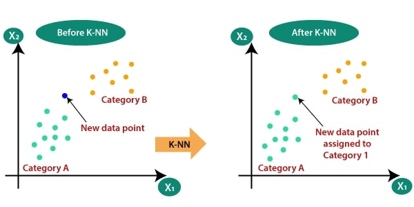
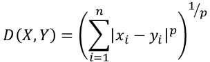

# K-Nearest-Neighbors-kNN-

# 1. Introduction

The k-nearest neighbors (KNN) algorithm is a simple, easy-to-implement supervised machine learning algorithm that can be used to solve both classification and regression problems.

# 2. kNN Algorithm
  
   

 * Based on the figure above, the distance between the new data and each data point will be measured and sorted ascending order.
    The Minkowski distance formula used to calculate:
     

    
 * By calculating the Minkowski distance we got the nearest neighbors, as three nearest neighbors in category A and two nearest neighbors in category B.
 
 * There is no particular way to determine the best value for "K", so we need to try some values to find the best out of them. The most preferred value for K is 5.

 * Hence the new Data Point is assigned to Category A because 3 of the 5 nearest neighbors are labeled as Category A. 
  

