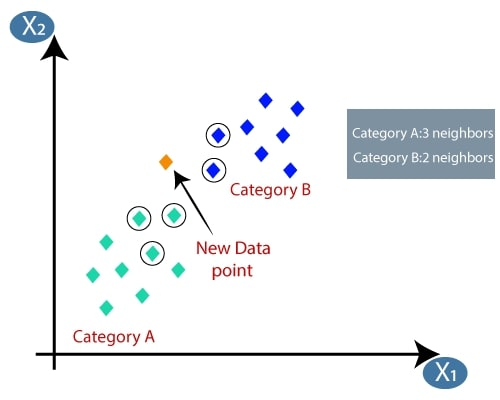

# K-Nearest-Neighbors-kNN-

# 1. Introduction

The k-nearest neighbors (KNN) algorithm is a simple, easy-to-implement supervised machine learning algorithm that can be used to solve both classification and regression problems.

# 2. Objective
Its purpose is to use a database in which the data points are separated into several classes to predict the classification of a new sample point.

# 3. kNN Algorithm
  
   

 * Based on the figure above, the distance between the new data and each data point will be measured and sorted ascending order.
    The Minkowski distance formula used to calculate:
     

    
 * By calculating the Minkowski distance we got the nearest neighbors, as three nearest neighbors in category A and two nearest neighbors in category B.

 
 * There is no particular way to determine the best value for "K", so we need to try some values to find the best out of them. The most preferred value for K is 5.

 * Hence the New Data Point is assigned to Category A because 3 out of the 5 nearest neighbors are labeled as Category A. 

 * The kNN algorithm assign the New Data Point to the majority label of k neighbors. 

# 4. Advantage
 * Quick calculation time
 * High accuracy – you do not need to compare with better-supervised learning models
 * No assumptions about data – no need to make additional assumptions, tune several parameters, or build a model. This makes it crucial in nonlinear data case. 
# 5. Disadvantage
 * Accuracy depends on the quality of the data
 * With large data, the prediction stage might be slow
 * Require high memory – need to store all of the training data
 * Sensitive to the scale of the data and irrelevant features
 * Given that it stores all of the training, it can be computationally expensive 

